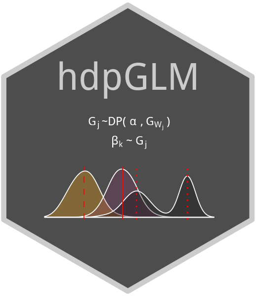

# hdpGLM 

[](https://cran.r-project.org/package=hdpGLM)

Overview
========

The package implements the hierarchical Dirichlet process Generalized
Linear Models proposed in the paper Modeling Context-Dependent Latent
Effect Heterogeneity. The model can be used to estimate latent
heterogeneity in the marginal effect of GLM linear coefficients, cluster
data points based on that latent heterogeneity, and investigate if
Simpson’s Paradox occurs due to latent or omitted features. It also can
be used with hierarchical data to estimate the effect of upper-level
covariates on the latent heterogeneity in the effect of lower-level
features.

For details of the model and the MCMC algorithm, see Ferrari, D. (2020) [Modeling
Context-Dependent Latent Effect
Heterogeneity](https://www.cambridge.org/core/journals/political-analysis/article/modeling-contextdependent-latent-effect-heterogeneity/B7B0AF067DF97A1A8F0B50646EF64F24), [Political
Analysis](https://www.cambridge.org/core/journals/political-analysis), Volume 28, Issue 1, January, pp. 20-46. <DOI: 10.1017/pan.2019.13>.

Instalation
===========

```

devtools::install_github("DiogoFerrari/hdpGLM")
# If you don't want to update the dependencies, use: (you may need to install some dependencies manually)
devtools::install_github("DiogoFerrari/hdpGLM", dependencies=F)

```

NOTE: it may be necessary to create a token to install the package from
the git repository in case it is private (see note at the bottom of help
page in R by running `help(install_github)`).

Usage
=====

Here is a simple example of how to use the package:

```
library(hdpGLM)

## Example for the dpGLM (no hierarchical structure)
## -------------- ------
set.seed(10)
K    = 3 # number of latent clusters
nCov = 3 # number of observed covariates
simdata = hdpGLM_simulateData(400, nCov=nCov, K=K, family='gaussian')
data    = simdata$data
mcmc    = list(burn.in=1, n.iter=400)
samples = hdpGLM(y~., data=data, mcmc=mcmc, n.display=200)

summary(samples)
coef(samples)
classify(data, samples)
plot(samples)
plot(samples, terms="X1")
plot(samples, separate=T)
plot(samples, true.beta=summary(simdata)$beta)
plot(samples, true.beta=summary(simdata)$beta, separate=T)

## Example for the hdpGLM (with hierarchical structure)
## -------------- -------
set.seed(6667)
simdata = hdpGLM_simulateData(40, 3, 2, nCovj=2, J=4, family='gaussian')
data    = simdata$data
mcmc    = list(burn.in=1, n.iter=100)
samples = hdpGLM(y~X1+X2, y~W1+W2, data=data, mcmc=mcmc, n.display=10)

summary(samples)
classify(data, samples)
coef(samples)
plot(samples)
plot(samples, terms = 'X1', j.idx=2:4)
plot_hdpglm(samples, ncol.tau=2)
plot_tau(samples)
plot_tau(samples, X='X1')

```
